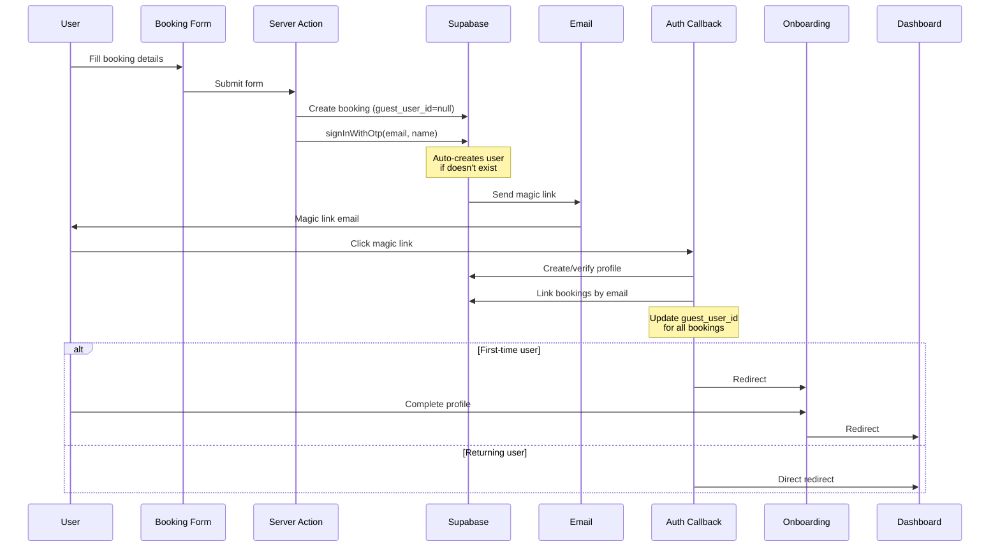

# SAE-28 Implementation Summary

## ✅ Implementation Complete

The mock booking form with onboarding flow has been successfully implemented using **modern, passwordless authentication** without requiring legacy service role keys.

## 🎯 What Was Implemented

### 1. **Mock Booking Form** (`app/page.tsx`)
- Replaced the landing page with a comprehensive booking form
- Fields: Name, Email, Check-In/Out Dates, Guest Count, Apartment Selection
- Real-time validation using React's `useActionState` hook
- Success state showing confirmation message
- Loading states during form submission

### 2. **Server Action** (`app/actions/mock-booking.ts`) - **Modern Approach**
- Zod schema validation for all form fields
- Creates booking record with email (user linkage happens post-authentication)
- Uses **`signInWithOtp()`** for passwordless authentication
  - ✨ Automatically creates users if they don't exist
  - ✨ No service role key required
  - ✨ Modern, secure approach
- Stores user's name in `user_metadata` for profile creation
- Sends magic link email with redirect to auth callback
- Comprehensive error handling with proper logging

### 3. **Onboarding Page** (`app/(protected)/onboarding/page.tsx`)
- Simple, welcoming UI for first-time users
- Form to collect full name (required) and phone (optional)
- Pre-fills name from `user_metadata` if available
- Updates profile with `onboarding_completed_at` timestamp
- Automatic redirect to dashboard after completion
- Prevents access for users who've already completed onboarding

### 4. **Auth Callback Updates** (`app/(public)/auth/callback/route.ts`)
- Creates profile with name from `user_metadata` if not exists
- **Links bookings to authenticated user** by email
- Updates `guest_user_id` for bookings that were created pre-authentication
- Checks `onboarding_completed_at` field after profile creation
- Routes first-time users (null `onboarding_completed_at`) to `/onboarding`
- Routes returning users directly to `/dashboard`

### 5. **Supporting Files**
- **Types** (`types/booking.ts`): TypeScript definitions for apartments and booking data
- **No Admin Client Needed**: Uses standard Supabase client with `signInWithOtp`
- **No Database Migrations Needed**: All required fields already exist in the schema

## 🔧 Required Configuration

### Environment Variables

**No additional environment variables required!** 

The implementation uses the standard Supabase client with existing variables:

```bash
# These should already be configured:
NEXT_PUBLIC_SUPABASE_URL=your_project_url
NEXT_PUBLIC_SUPABASE_ANON_KEY=your_anon_key

# Optional (defaults to http://localhost:3000 in development):
NEXT_PUBLIC_SITE_URL=https://your-production-domain.com
```

**No service role key needed** - we use the modern `signInWithOtp()` API which handles user creation automatically.

## 🏗️ Architecture Flow



## 📋 Testing Checklist

### ✅ New User Flow
1. Navigate to `http://localhost:3000`
2. Fill out the booking form with a **new email address**
3. Submit the form → should see success message
4. Check your email for the magic link
5. Click the magic link → should redirect to `/onboarding`
6. Complete the onboarding form → should redirect to `/dashboard`
7. Verify the booking appears in the dashboard

### ✅ Existing User Flow
1. Navigate to `http://localhost:3000`
2. Fill out the booking form with an **existing email address**
3. Submit the form → should see success message
4. Click the magic link → should redirect **directly to `/dashboard`** (skip onboarding)
5. Verify the new booking appears alongside existing bookings

### ✅ Validation Testing
- Submit with missing fields → should show field-specific errors
- Submit with invalid email format → should show email error
- Submit with check-out before check-in → should show date validation error
- Submit with 0 or negative guest count → should show min value error

## 🗂️ Files Changed

```
app/
├── page.tsx                              # ✅ Replaced with mock booking form
├── actions/
│   └── mock-booking.ts                   # ✅ Modern server action (no admin API)
├── (protected)/
│   └── onboarding/
│       └── page.tsx                      # ✅ New onboarding page
└── (public)/
    └── auth/
        └── callback/
            └── route.ts                  # ✅ Updated with booking linkage

types/
└── booking.ts                            # ✅ New types

lib/supabase/
└── admin.ts                              # ❌ REMOVED (not needed)
```

## 🔒 Security & Best Practices

- ✅ **No service role key required** - uses modern passwordless auth
- ✅ **Automatic user creation** - handled by Supabase `signInWithOtp()`
- ✅ **Email-based booking linkage** - bookings tied to email, then user_id after auth
- ✅ **Server-side validation** - Zod schema prevents invalid data
- ✅ **Proper error handling** - technical details logged server-side, user-friendly messages shown
- ✅ **User metadata** - name stored during signup for profile creation
- ✅ **Idempotent operations** - safe to run multiple times

## 📊 Database Schema

No migrations were required. The implementation uses existing fields:

**`profiles` table:**
- `onboarding_completed_at` - Used to determine first-time users
- `full_name` - Populated from user_metadata or onboarding form

**`bookings` table:**
- `guest_user_id` - Initially null, linked after authentication
- `email` - Used to match bookings to authenticated users
- `external_booking_id` - Set to `mock-{uuid}` format
- `guest_count` - Number of guests
- `room_name` - Selected apartment name
- `check_in` / `check_out` - Booking dates
- `status` - Set to `'confirmed'`

## 🚀 Next Steps

1. **Test the Implementation**:
   ```bash
   cd /Users/martin/Documents/Coding/Saele/saele
   pnpm dev
   ```

2. **Test Flows**: Follow the testing checklist above

3. **Deploy**: Once testing is complete, merge to main and deploy

## 🎨 UI/UX Features

- Clean, modern design matching existing Saele brand
- Responsive layout (mobile-friendly)
- Loading states during async operations
- Success confirmation with email address
- Field-specific error messages
- Dark mode support (inherited from global styles)
- Accessibility: Proper labels, ARIA attributes, keyboard navigation

## 🌟 Key Improvements Over Legacy Approach

### Before (Legacy):
- ❌ Required `SUPABASE_SERVICE_ROLE_KEY` environment variable
- ❌ Used Admin API to manually create users
- ❌ Required separate profile creation step
- ❌ More complex error handling
- ❌ Security risk if service role key exposed

### After (Modern):
- ✅ No service role key needed
- ✅ `signInWithOtp()` auto-creates users
- ✅ Profile created automatically with metadata
- ✅ Simpler, cleaner code
- ✅ More secure (no elevated privileges required)

## 🔗 Related Documentation

- Linear Issue: [SAE-28](https://linear.app/clubjam/issue/SAE-28)
- Supabase Project: `sbbcczpdlzmhwpytglgr`
- Feature Branch: `martin/sae-28-mockbuchungsformular-user-anlegen-magiclinklogin`
- [Supabase signInWithOtp Docs](https://supabase.com/docs/reference/javascript/auth-signinwithotp)

---

**Implementation Date**: January 14, 2026  
**Status**: ✅ Complete & Ready for Testing  
**Approach**: Modern passwordless authentication (no legacy admin API)
