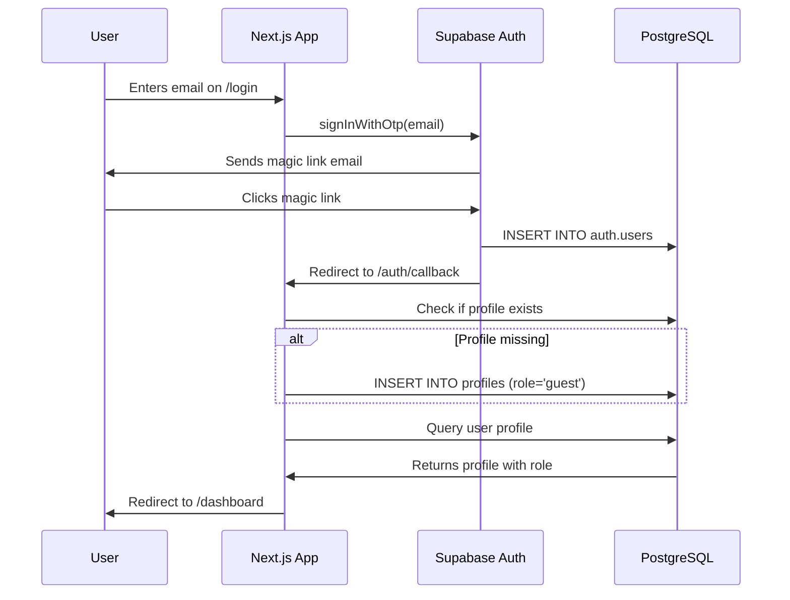
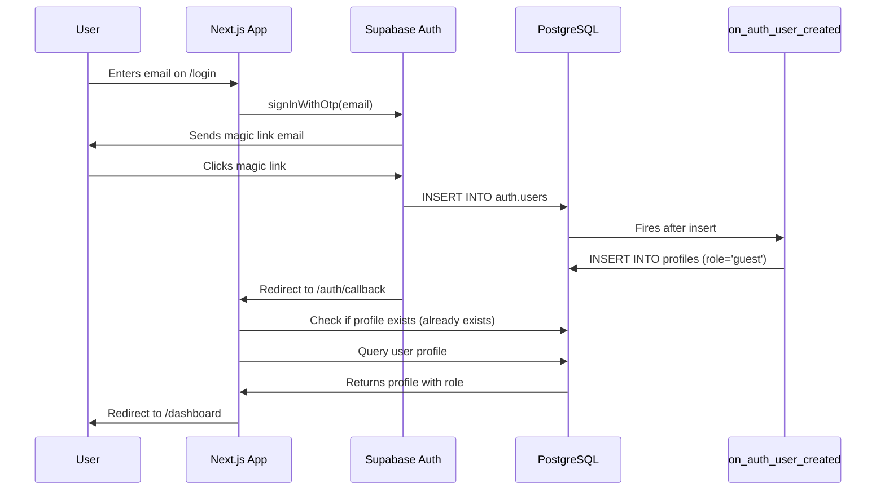

# Saele Database Schema Documentation

This document describes the database schema for the Saele MVP, including tables, relationships, Row Level Security (RLS) policies, and testing scenarios.

## Overview

The Saele database schema supports a booking management system with two user roles:
- **Guest**: Can view their own bookings and profile
- **Admin**: Can view and manage all data

The schema is implemented in Supabase (PostgreSQL) with comprehensive Row Level Security policies to ensure data isolation and security.

## Tables

### 1. `profiles`
Stores user profile information with role-based access control.

**Columns:**
- `user_id` (uuid, PK): References `auth.users(id)`, 1:1 relationship
- `role` (text): User role - `'guest'` or `'admin'` (default: `'guest'`)
- `full_name` (text): User's full name
- `phone` (text): Contact phone number
- `created_at` (timestamptz): Profile creation timestamp
- `updated_at` (timestamptz): Last update timestamp (auto-updated via trigger)

**Purpose:** Extends Supabase Auth users with role information and additional profile data.

**Relationships:**
- 1:1 with `auth.users` (cascade delete)

---

### 2. `bookings`
Stores guest bookings from external booking systems.

**Columns:**
- `id` (uuid, PK): Unique booking identifier
- `external_booking_id` (text, UNIQUE): Idempotency key from external booking system
- `guest_user_id` (uuid, FK): References `auth.users(id)` (nullable, set null on delete)
- `email` (text): Guest email (redundant for traceability)
- `check_in` (date): Check-in date
- `check_out` (date): Check-out date
- `status` (text): Booking status - `'confirmed'` or `'cancelled'` (default: `'confirmed'`)
- `created_at` (timestamptz): Booking creation timestamp

**Purpose:** Tracks guest reservations, ensuring idempotency through `external_booking_id` unique constraint.

**Relationships:**
- Many-to-one with `auth.users` (guest_user_id)

**Indexes:**
- `idx_bookings_guest_user_id` on `guest_user_id`
- `idx_bookings_email` on `email`
- `idx_bookings_status` on `status`

---

### 3. `host_contacts`
Stores property/tenant contact information displayed to guests.

**Columns:**
- `id` (uuid, PK): Unique contact identifier
- `display_name` (text): Contact name shown to guests
- `email` (text): Contact email
- `phone` (text): Contact phone number
- `whatsapp` (text): WhatsApp number
- `is_active` (boolean): Whether contact is currently active (default: `true`)
- `created_at` (timestamptz): Record creation timestamp

**Purpose:** Provides contact information to guests for support and inquiries.

**Relationships:** None

**Indexes:**
- `idx_host_contacts_is_active` on `is_active`

---

### 4. `notifications`
Queue system for email notifications and magic links.

**Columns:**
- `id` (uuid, PK): Unique notification identifier
- `type` (text): Notification type (e.g., `'magic_link'`, `'booking_confirmation'`)
- `recipient_email` (text): Email recipient
- `user_id` (uuid, FK): References `auth.users(id)` (nullable)
- `booking_id` (uuid, FK): References `bookings(id)` (nullable)
- `payload` (jsonb): Additional data for notification template
- `status` (text): Queue status - `'queued'`, `'sent'`, or `'failed'` (default: `'queued'`)
- `attempts` (int): Number of send attempts (default: `0`)
- `last_error` (text): Last error message if failed
- `created_at` (timestamptz): Notification creation timestamp
- `sent_at` (timestamptz): Timestamp when successfully sent

**Purpose:** Manages notification delivery pipeline with retry logic and status tracking.

**Relationships:**
- Many-to-one with `auth.users` (user_id)
- Many-to-one with `bookings` (booking_id)

**Indexes:**
- `idx_notifications_status` on `status`
- `idx_notifications_recipient_email` on `recipient_email`
- `idx_notifications_user_id` on `user_id`
- `idx_notifications_booking_id` on `booking_id`

---

### 5. `event_logs`
Audit trail for webhooks, system events, and errors.

**Columns:**
- `id` (uuid, PK): Unique log entry identifier
- `event_type` (text): Event type (e.g., `'booking_confirmed'`, `'webhook_received'`)
- `external_id` (text): External system identifier for correlation
- `request_id` (text): Request/trace identifier
- `user_id` (uuid, FK): References `auth.users(id)` (nullable)
- `booking_id` (uuid, FK): References `bookings(id)` (nullable)
- `level` (text): Log level - `'info'`, `'warn'`, or `'error'` (default: `'info'`)
- `message` (text): Log message
- `meta` (jsonb): Additional metadata
- `created_at` (timestamptz): Log entry timestamp

**Purpose:** Provides comprehensive audit trail for debugging and compliance.

**Relationships:**
- Many-to-one with `auth.users` (user_id)
- Many-to-one with `bookings` (booking_id)

**Indexes:**
- `idx_event_logs_external_id` on `external_id`
- `idx_event_logs_event_type` on `event_type`
- `idx_event_logs_booking_id` on `booking_id`
- `idx_event_logs_created_at` on `created_at` (descending)

---

## Row Level Security (RLS) Policies

RLS is enabled on all tables to enforce data isolation and access control.

### Security Model Summary

| Table | Guest (Read) | Guest (Write) | Admin (Read) | Admin (Write) | Service Role |
|-------|--------------|---------------|--------------|---------------|--------------|
| `profiles` | Own only | Own only* | All | All | Bypass RLS |
| `bookings` | Own only | ❌ | All | All | Bypass RLS |
| `host_contacts` | Active only | ❌ | All | All | Bypass RLS |
| `notifications` | ❌ | ❌ | All | All | Bypass RLS |
| `event_logs` | ❌ | ❌ | All | All | Bypass RLS |

\* Guests can update their own `full_name` and `phone` but cannot change their `role`.

### Helper Functions

#### `is_admin()`
Returns `true` if the current user has the `'admin'` role.

```sql
select public.is_admin();
```

Used in RLS policies to check admin privileges.

---

### Policy Details

#### Profiles
- **Guest read**: Can only view their own profile (`auth.uid() = user_id`)
- **Guest write**: Can update their own `full_name` and `phone` (role is immutable)
- **Admin read/write**: Full access to all profiles
- **Insert**: Users can create their own profile on signup

#### Bookings
- **Guest read**: Can only view bookings where `guest_user_id = auth.uid()`
- **Guest write**: No write access (bookings are created via webhooks using Service Role)
- **Admin read/write**: Full access to all bookings

#### Host Contacts
- **Authenticated users**: Can view contacts where `is_active = true`
- **Admin**: Can view all contacts (including inactive) and perform CRUD operations
- **Unauthenticated**: No access

#### Notifications
- **Guest**: No access
- **Admin**: Full read/write access
- **Service Role**: Bypasses RLS for automated notification processing

#### Event Logs
- **Guest**: No access
- **Admin**: Full read/write access
- **Service Role**: Bypasses RLS for automated logging

---

## Database Triggers

### `handle_profiles_updated_at`
Automatically updates the `updated_at` timestamp on `profiles` table whenever a row is updated.

```sql
create trigger handle_profiles_updated_at
  before update on public.profiles
  for each row
  execute function public.handle_updated_at();
```

### `on_auth_user_created` (Local Development Only)
Automatically creates a guest profile when a new user is created in `auth.users`.

**⚠️ Important: Trigger vs Application-Level Profile Creation**

Due to Supabase security restrictions on the `auth.users` table in hosted environments, we use different approaches for local development vs production:

**Local Development (Supabase CLI):**
```sql
create trigger on_auth_user_created
  after insert on auth.users
  for each row
  execute function public.handle_new_user();
```

**Production/Hosted Supabase:**
Profile creation is handled in [`app/(public)/auth/callback/route.ts`](../app/(public)/auth/callback/route.ts) at the application level. The auth callback checks if a profile exists and creates one if missing.

**Function implementation** (available in both environments):
```sql
create or replace function public.handle_new_user()
returns trigger as $$
begin
  insert into public.profiles (user_id, role, created_at, updated_at)
  values (new.id, 'guest', now(), now());
  return new;
end;
$$ language plpgsql security definer;
```

This ensures that every authenticated user has a corresponding profile with the default `'guest'` role, regardless of environment.

---

## Profile Creation Flow

When a new user signs up, profile creation depends on the environment:

### Production/Hosted Supabase Flow



### Local Development Flow (with trigger)



**Key Points:**
1. Profile creation is **automatic** in both environments
2. Default role is always `'guest'` for new users
3. **Production:** Profile created in auth callback ([`route.ts`](../app/(public)/auth/callback/route.ts))
4. **Local Dev:** Profile created by database trigger (if configured)
5. Application code checks for existing profile to ensure idempotency
6. Admins must manually update the `role` column to promote users to `'admin'`

**Why Two Approaches?**
Hosted Supabase restricts direct triggers on `auth.users` for security. The application-level approach provides the same functionality while respecting these security boundaries.

---

## Migration Workflow

### Local Development

1. **Start Supabase locally** (requires Docker):
   ```bash
   npm run db:start
   ```

2. **Apply migrations**:
   ```bash
   npm run db:reset
   ```
   This resets the database and applies all migrations in order.

3. **Generate TypeScript types**:
   ```bash
   npm run types:gen
   ```
   Updates `lib/supabase/database.types.ts` with latest schema.

4. **Stop Supabase**:
   ```bash
   npm run db:stop
   ```

### Production Deployment

Migrations are located in `supabase/migrations/`:
- `20241218000000_initial_schema.sql` - Core tables and indexes
- `20241218000001_rls_policies.sql` - RLS policies and triggers
- `20241218000002_auto_create_profile.sql` - Profile creation function and trigger (local dev)

**For hosted Supabase:**
```bash
# Deploy migrations (function will be created, trigger will be skipped in production)
supabase db push
```

The trigger in `20241218000002_auto_create_profile.sql` works in local development but cannot be applied to hosted Supabase due to security restrictions on `auth.users`. Profile creation is automatically handled by the application in [`app/(public)/auth/callback/route.ts`](../app/(public)/auth/callback/route.ts).

---

## Seeding Test Data

The `supabase/seed.sql` file contains sample data for development:
- 1 admin user (`admin@saele.com`)
- 2 guest users (`guest1@saele.com`, `guest2@saele.com`)
- 4 sample bookings
- 3 host contacts
- Sample notifications in different states (queued, sent, failed)
- Event log entries

**Run seed data:**
```bash
npm run db:reset  # Applies migrations and seed data
```

**Note:** Seed data uses placeholder UUIDs (`00000000-0000-0000-0000-00000000000X`). In production, users are created via Supabase Auth, which generates real UUIDs.

---

## Testing Scenarios

### ✅ Test Case 1: Guest User Access
**Setup:** Login as `guest1@saele.com`

**Expected Results:**
- ✅ Can view own profile
- ✅ Can view own bookings (2 bookings)
- ✅ Can view active host contacts (2 contacts)
- ❌ Cannot view other guests' profiles
- ❌ Cannot view other guests' bookings
- ❌ Cannot view notifications
- ❌ Cannot view event logs

**SQL Test:**
```sql
-- Set session to guest user
set request.jwt.claims to '{"sub": "00000000-0000-0000-0000-000000000002"}';

select * from public.profiles;  -- Should return 1 row (own profile)
select * from public.bookings;  -- Should return 2 rows (own bookings)
select * from public.host_contacts;  -- Should return 2 rows (active contacts)
select * from public.notifications;  -- Should return 0 rows
select * from public.event_logs;  -- Should return 0 rows
```

---

### ✅ Test Case 2: Admin User Access
**Setup:** Login as `admin@saele.com`

**Expected Results:**
- ✅ Can view all profiles (3 profiles)
- ✅ Can view all bookings (4 bookings)
- ✅ Can view all host contacts (3 contacts, including inactive)
- ✅ Can view all notifications
- ✅ Can view all event logs
- ✅ Can update any profile
- ✅ Can create/update/delete bookings

**SQL Test:**
```sql
-- Set session to admin user
set request.jwt.claims to '{"sub": "00000000-0000-0000-0000-000000000001"}';

select * from public.profiles;  -- Should return 3 rows (all users)
select * from public.bookings;  -- Should return 4 rows (all bookings)
select * from public.host_contacts;  -- Should return 3 rows (all contacts)
select * from public.notifications;  -- Should return all notifications
select * from public.event_logs;  -- Should return all logs
```

---

### ✅ Test Case 3: Unauthenticated Access
**Setup:** No authentication

**Expected Results:**
- ❌ Cannot view any profiles
- ❌ Cannot view any bookings
- ❌ Cannot view any host contacts
- ❌ Cannot view any notifications
- ❌ Cannot view any event logs

**SQL Test:**
```sql
-- Clear session (unauthenticated)
reset request.jwt.claims;

select * from public.profiles;  -- Should return 0 rows
select * from public.bookings;  -- Should return 0 rows
select * from public.host_contacts;  -- Should return 0 rows
```

---

### ✅ Test Case 4: Idempotency
**Setup:** Attempt to create duplicate booking

**Expected Results:**
- ❌ Duplicate `external_booking_id` should fail with unique constraint violation

**SQL Test:**
```sql
insert into public.bookings (external_booking_id, email, status)
values ('EXT-BOOKING-001', 'test@example.com', 'confirmed');
-- Should fail: duplicate key value violates unique constraint
```

---

### ✅ Test Case 5: Guest Profile Update
**Setup:** Login as guest user, attempt to update profile

**Expected Results:**
- ✅ Can update own `full_name` and `phone`
- ❌ Cannot change own `role` to `'admin'`

**SQL Test:**
```sql
-- Set session to guest user
set request.jwt.claims to '{"sub": "00000000-0000-0000-0000-000000000002"}';

update public.profiles 
set full_name = 'Updated Name'
where user_id = '00000000-0000-0000-0000-000000000002';
-- Should succeed

update public.profiles 
set role = 'admin'
where user_id = '00000000-0000-0000-0000-000000000002';
-- Should fail: policy violation
```

---

### ✅ Test Case 6: Automatic Profile Creation

**Setup:** Create a new user via Supabase Auth

**Expected Results:**
- ✅ Profile is automatically created with `role = 'guest'`
- ✅ Profile `user_id` matches `auth.users.id`
- ✅ `created_at` and `updated_at` are set automatically
- ✅ `full_name` and `phone` are NULL (awaiting user input)

**SQL Test:**
```sql
-- Simulate new user creation (in production, this happens via Auth API)
-- For testing, you can verify the trigger is installed:
select tgname, tgtype, tgenabled 
from pg_trigger 
where tgrelid = 'auth.users'::regclass 
and tgname = 'on_auth_user_created';

-- After a real signup, verify profile exists:
select u.email, p.role, p.created_at
from auth.users u
inner join public.profiles p on p.user_id = u.id
where u.email = 'newuser@example.com';
-- Should return: role = 'guest', created_at = recent timestamp
```

**Manual Test:**
See [`TESTING.md`](./TESTING.md) for step-by-step instructions on testing automatic profile creation through the UI.

---

## TypeScript Type Safety

All tables have corresponding TypeScript types generated in `lib/supabase/database.types.ts`.

**Usage Example:**
```typescript
import { createClient } from '@/lib/supabase/server';
import type { Database } from '@/lib/supabase/database.types';

const supabase = createClient();

// Type-safe query
const { data: bookings } = await supabase
  .from('bookings')
  .select('*')
  .eq('status', 'confirmed'); // ✅ Type-checked: 'confirmed' is valid

// Type-safe insert
const { data: newBooking } = await supabase
  .from('bookings')
  .insert({
    external_booking_id: 'EXT-001',
    email: 'guest@example.com',
    status: 'confirmed', // ✅ Autocomplete and validation
  });
```

---

## Architecture Diagram

```
┌─────────────────┐
│  Booking System │ (External)
│   (Webhook)     │
└────────┬────────┘
         │
         ▼
┌─────────────────────────────────────────┐
│         Supabase Backend                │
│  (Service Role - Bypasses RLS)          │
│                                         │
│  1. Receive webhook                     │
│  2. Create/update booking               │
│  3. Create/update user profile          │
│  4. Queue notification                  │
│  5. Log event                           │
└─────────────────────────────────────────┘
         │
         ▼
┌─────────────────────────────────────────┐
│          Database (PostgreSQL)          │
│                                         │
│  ┌──────────┐  ┌──────────┐            │
│  │ profiles │  │ bookings │            │
│  └────┬─────┘  └────┬─────┘            │
│       │             │                  │
│  ┌────┴──────────┬──┴────────┐         │
│  │ notifications │ event_logs│         │
│  └───────────────┴───────────┘         │
│                                         │
│  RLS: guest/admin access control        │
└─────────────────────────────────────────┘
         │
         ▼
┌─────────────────────────────────────────┐
│       Next.js Frontend (SSR/Client)     │
│       (Anon Key - Respects RLS)         │
│                                         │
│  Guest View:                            │
│  - Own profile & bookings               │
│  - Active host contacts                 │
│                                         │
│  Admin View:                            │
│  - All profiles & bookings              │
│  - All notifications & logs             │
│  - Manage host contacts                 │
└─────────────────────────────────────────┘
```

---

## Environment Variables

Required environment variables (see `.env.local.example`):

```bash
NEXT_PUBLIC_SUPABASE_URL=your-project-url
NEXT_PUBLIC_SUPABASE_ANON_KEY=your-anon-key
SUPABASE_SERVICE_ROLE_KEY=your-service-role-key  # Server-only!
```

---

## Next Steps

1. **Apply migrations** to your Supabase project (local or production)
2. **Test RLS policies** using the scenarios above
3. **Implement webhook endpoint** to handle booking confirmations
4. **Build notification processor** to send queued notifications
5. **Create UI components** for guest and admin dashboards

---

## Automated Testing

For automated verification of all RLS policies, run the SQL test suite:

```bash
# Via Supabase CLI
supabase db execute --file supabase/tests/verify-rls.sql

# Or copy/paste into Supabase Studio SQL Editor
```

The test suite verifies:
- All RLS policies work as documented
- Guest users can only access their own data
- Admin users have full access
- Role immutability is enforced
- Triggers and helper functions work correctly

See [`supabase/tests/verify-rls.sql`](./supabase/tests/verify-rls.sql) for the complete test suite.

For manual E2E testing, see [`TESTING.md`](./TESTING.md).

---

## Support

For questions or issues with the schema, contact the dev team or refer to:
- [Supabase RLS Documentation](https://supabase.com/docs/guides/auth/row-level-security)
- [PostgreSQL Documentation](https://www.postgresql.org/docs/)
- [Testing Guide](./TESTING.md) - Manual testing instructions
- [RLS Verification Script](./supabase/tests/verify-rls.sql) - Automated tests
